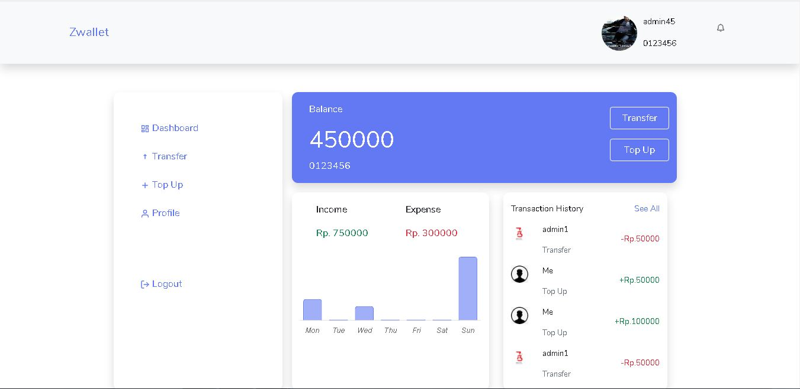

<h1 align='center'>Next JS - Zwallet E-Wallet Apps</h1>
  <p align="center">
    <a href="https://zwallet-frontend-project-apps.vercel.app/">View Demo</a>
    ·
    <a href="https://github.com/akbarsaladin36/zwallet-frontend-project-apps/issues">Report Bug</a>
    ·
    <a href="https://github.com/akbarsaladin36/zwallet-frontend-project-apps/pulls">Request Feature</a>
  </p>



## About The Project

Zwallet is a e-wallet project that created with Next.js framework for React and Node.js to make people can transfer or top-up their money online easily. Zwallet can be used on your laptop, PC or mobile phone. 

## Built With

[](https://github.com/facebook/react)
[](https://github.com/react-bootstrap/react-bootstrap)

## Requirements

1. <a href="https://github.com/vercel/next.js/tree/canary/packages/create-next-app">Next JS</a>
2. Node_modules `npm install` or `yarn install`
3. Backend API Zwallet [`here`](https://github.com/akbarsaladin36/zwallet-backend-project-apps.git)

## Getting Started

1. Download this Project or you can type `git clone https://github.com/akbarsaladin36/zwallet-backend-project-apps.git`
2. Open app's directory in CMD or Terminal
3. Type `npm install` or `yarn install`
4. Add next.config.js file at root folder project

```sh
module.exports = {
  env: {
    BASE_URL: <YOUR BACKEND API URL>,
    BASE_IMAGE_URL: <YOUR BACKEND IMAGE API URL>,
  }
}
```

5. Type `npm run dev`

## Feature

1. Login and Register User
2. Update Profile User Data
3. Update and Delete Profile User Image
4. Search Receiver's Data
5. Transfer To Receiver and Top Up Balance
6. Update User's PIN for Transfer
7. Update User's Password 

## Acknowledgements

- [Axios](https://www.npmjs.com/package/axios)
- [React](https://reactjs.org/)
- [React Bootstrap](https://react-bootstrap.github.io/)
- [Redux](https://github.com/reduxjs/react-redux)
- [Next](https://nextjs.org/docs/getting-started)

## License

© [Muhammad Akbar Saladin Siregar](https://github.com/akbarsaladin36/)